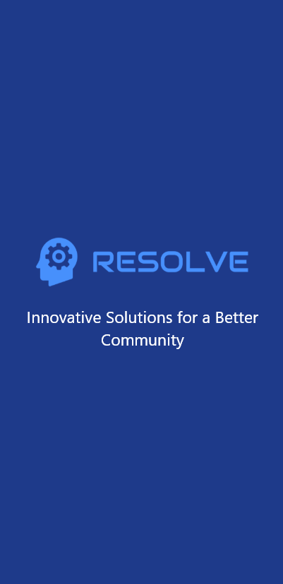
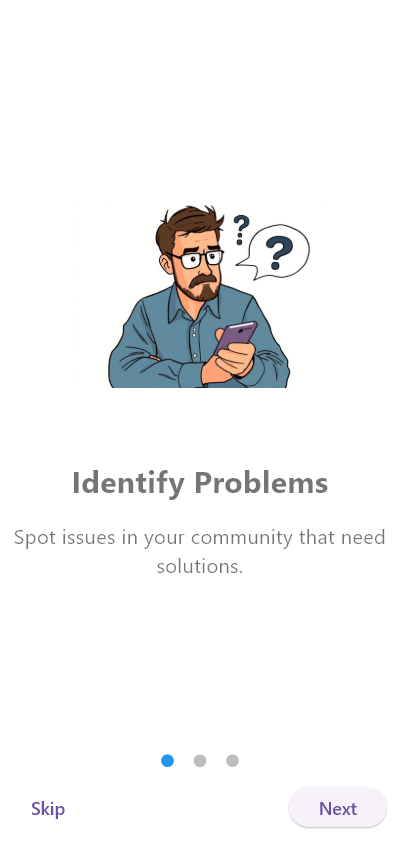
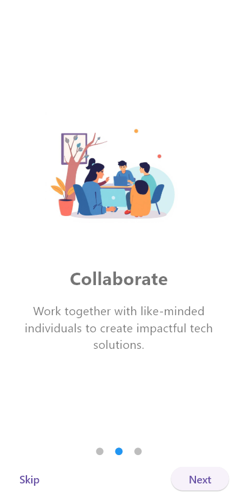
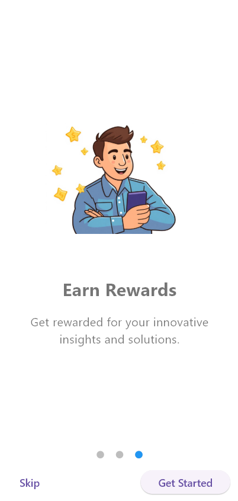
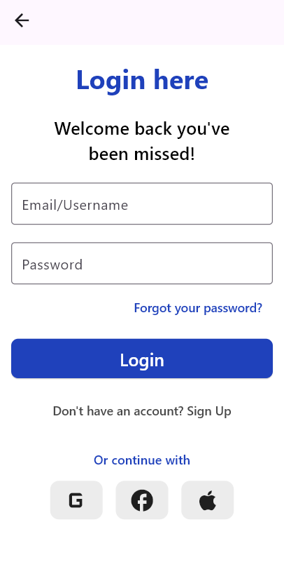
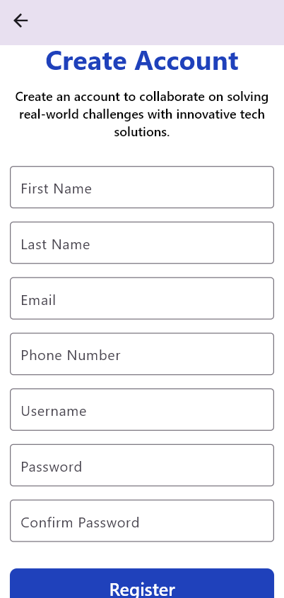
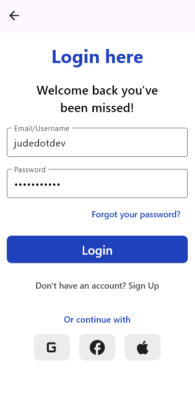
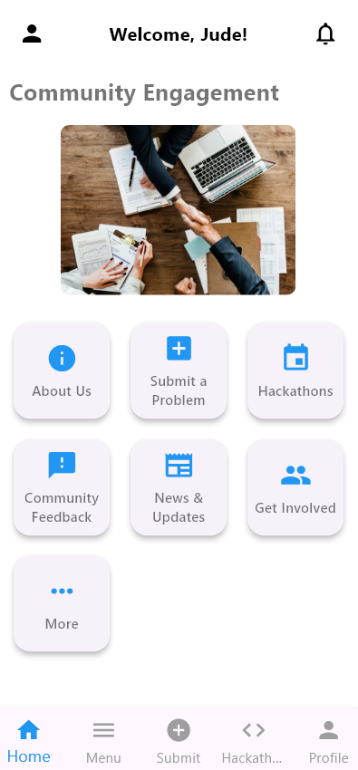

# RESOLVE FLUTTER APP

Innovative Solutions for a Better Community.

This repository contains the source code for the resolve flutter application frontend and backend.

- Frontend: [resolve_app](./resolve_app/)
- Backend: [resolve-backend](./resolve-backend/)
- Pitch Deck: [Resolve Technologies Pitch Deck](./Resolve_Technologies_Pitch_Deck.pdf)

## ABOUT

This Mobile App allows users to identify problems in their community that need urgent solution.
The users will then Submit the Problem in the Mobile App, and the Resolve Tech team will review this problem and provide a solution to this problem. Especially if this problem can be solved using technology.

The mobile app was built using Dart and Flutter for the fronend, and Node JS for the backend, with a MongoDB database.

## PREVIEW THE APP

SPLASH SCREEN

IDENTIFY PROBLEMS

COLLABORATE

EARN REWARDS

LOGIN SCREEN

REGISTER SCREEN

LOGIN WITH USERNAME AND PASSWORD

DASHBOARD

SUBMIT PROBLEM SCREEN

